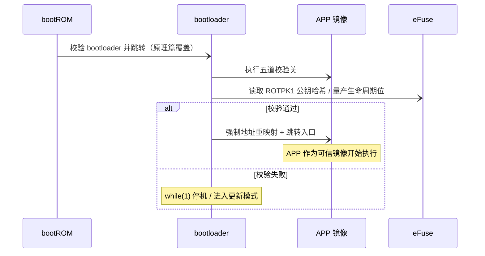
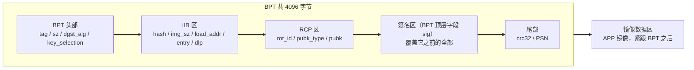
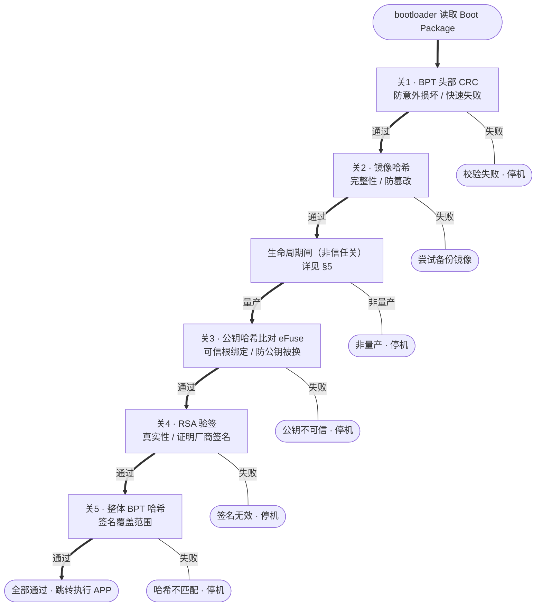
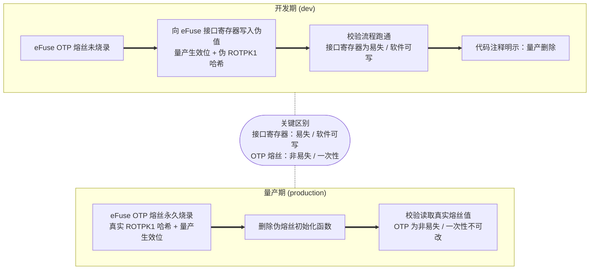

## 0 前情回顾

> **前情回顾**：在原理篇 [《MCU 安全启动流程分析》](/posts/secure-boot-analysis/) 中，我们建立了通用安全启动的三根支柱——**链式逐级启动**（bootROM → bootloader → APP）、**RSA 非对称验签**（厂商私钥离线签名、设备端公钥验签）、以及 **eFuse 硬件可信根**（公钥哈希一次性烧录、永久不可改）。

本文不再重复这套通用框架（RSA 与签名验签的标准流程详见原理篇 §3、§4），而是落到一颗具体的车规 MCU——**芯驰 E3640**——看它的 bootloader 是如何用**五道校验关**把 APP 镜像"验明白"的。这是一篇芯片实战续集：通用道理请回看原理篇，本文只讲 E3640 特有的落地细节、踩过的坑、以及 Boot Package 里那些数据到底住在哪里。

## 1 威胁与安全启动必须保证什么

在展开任何一道校验关之前，先回答"为什么需要安全启动"。

### 1.1 威胁模型

车规 MCU 面对的是**物理可达**的攻击者：拆机、调试接口、直接改写片外 Flash 都是真实现状。具体到 APP 镜像，典型威胁有三类：

1. **刷入篡改过的 APP**——攻击者修改业务逻辑（如绕过功能限制、植入后门）后重新烧录；
2. **整体替换镜像**——把厂商镜像整个换成自己编译的版本；
3. **偷换验签公钥**——最隐蔽的一种：攻击者把自己的公钥也写进 Boot 区，这样他自己签的镜像也能"验签通过"，把整条信任链连根拔起。

### 1.2 安全启动必须保证的四件事

从上面的威胁，可以反推出安全启动必须保证的四条性质：

| 性质 | 含义 | 对抗的威胁 |
|------|------|-----------|
| **完整性 Integrity** | 镜像每一个字节都没被改动 | 篡改业务逻辑 |
| **真实性 Authenticity** | 镜像确实由厂商签名 | 整体替换镜像 |
| **不可否认 Non-repudiation** | 厂商无法抵赖"这个签名不是我签的" | 抵赖归属（RSA 非对称天然提供） |
| **硬件可信根绑定** | 验签用的"锚"钉死在芯片里，攻击者换不掉 | **偷换公钥** |

前三件事（完整性 / 真实性 / 不可否认）靠密码学解决，原理篇 §3（RSA 非对称理论）、§4（签名 + 验签标准流程）已详细推导，本文不重复。真正容易被忽视、也是本文重点的是**第四件：硬件可信根绑定**——它回答的是"凭啥相信 Boot 里那把公钥就是厂商的公钥"。

### 1.3 E3640 的三个特有落地点

把这四件事落到 E3640 上，有三个具体的设计选择：

- **算法选型：RSA2048**。强度与验签性能的平衡点（原理篇 §3.3 列过 RSA 各档规格）；E3640 的 Boot 区固定按 RSA2048 做公钥运算。
- **公钥放在 Boot Package 的 RCP 区**，随镜像一起分发（详见 §4）。
- **公钥的哈希（ROTPK）烧在 eFuse 里**，作为硬件可信根。设备本地只信 eFuse 里这把哈希，不信 Flash 里随便谁写的公钥——这就是"锚"。

*（概念示意图占位 · 硬件可信根 / 信任锚；作者后续 AI 生成）*

那么 bootloader 是怎么用这把"锚" + 这五件事，把一个 APP 镜像一次性验明白的？答案就是 §2 的五道校验关。

## 2 五道校验关

E3640 的 bootloader 校验 APP 镜像时，不是"验一把签"就完事，而是**五道串行校验关**，每道关只解决一个具体问题，任何一道失败就**立即早退、拒绝跳转**。这五道关是全文的技术脊梁。

| 关 | 名称 | 解决什么问题 |
|----|------|-------------|
| 关 1 | BPT 头部 CRC | **防意外损坏 / 快速失败**——便宜的先做，挡住偶然位翻转 |
| 关 2 | 镜像哈希 | **完整性 / 防篡改**——镜像字节一个都不能动 |
| 关 3 | 公钥哈希比对 eFuse | **可信根绑定 / 防公钥被换**——把验签公钥钉死到硬件锚 |
| 关 4 | RSA 验签 | **真实性 / 证明厂商签名**——这确实是厂商签的 |
| 关 5 | 整体 BPT 哈希 | **签名覆盖范围**——证明被签的就是眼前这份 BPT |

### 2.1 为什么是五道，而不是"直接 RSA 验签"

一个自然的问题是：既然最终要靠 RSA 证明真实性，为什么不直接做 RSA 验签，前面要叠这么多关？因为这五道关各自堵一个**不同层级**的漏洞，且**成本递增**：

- **关 1 CRC** 最便宜，先用一次 CRC32 把"Flash 偶然坏了 / 烧录出错"这类**非恶意**损坏挡在门外，避免后续昂贵的密码学运算白白跑一遍。
- **关 2 镜像哈希**用 SHA256 保证镜像**完整性**——任何字节改动都会让哈希对不上。
- **关 3 公钥哈希比对 eFuse** 是防"偷换公钥"的关键：即便攻击者在 Flash 的 RCP 区写了自己的公钥，eFuse 里烧的是厂商公钥哈希，对不上就直接拒。
- **关 4 RSA 验签**才正式证明**真实性**——签名只能由持有私钥的厂商产生。
- **关 5 整体 BPT 哈希**收口"签名覆盖范围"：证明厂商签的"就是眼前这份 BPT"，防止签名和数据之间的绑定被钻空子（详见 §4 签名区说明）。

层层递进、各司其职，任何一道失败就停。

### 2.2 控制流伪代码（忠实于真实执行顺序）

下面这段控制流伪代码忠实还原了 E3640 bootloader 校验 APP 镜像的**真实顺序与早退逻辑**，只用语义字段名（可追溯的 BPT 字段名括注于反引号内），不含任何 C 类型 / 偏移地址。注意：真实代码顺序里，在关 2 和关 3 之间还夹着一个**"生命周期闸"**——它是**模式闸**（这颗芯片进没进量产？），不是信任闸，所以不计入"五道信任关"，完整解释放 §5。

> **控制流伪代码：`校验 APP 镜像` 的真实执行顺序**（语义字段名，每步失败立即早退；`→` 表示返回）
>
> - 写入开发期伪熔丝、初始化密码引擎（**仅开发期，量产删除**，详见 §5）
> - **关 1 · BPT 头部 CRC**「防意外损坏 / 快速失败」：`BPT.尾部.crc32` ≠ CRC32(BPT 除尾部校验字段外的全部) → 返回失败（硬停，不进入后续昂贵运算）
> - **关 2 · 镜像哈希**「完整性 / 防篡改」：SHA256(镜像数据, 镜像长度 `IIB.img_sz`) ≠ `IIB.hash` → 返回失败（尝试备份镜像）
> - **生命周期闸（非信任关，详见 §5）**：芯片不在量产生命周期 → 返回失败
> - **关 3 · 公钥哈希比对 eFuse**「可信根绑定 / 防公钥被换」：SHA256(BPT.RCP 整区) ≠ eFuse.ROTPK1 → 返回失败（公钥不可信）
> - **关 4 · RSA 验签**「真实性 / 证明厂商签名」：对签名 `sig` 做原始 RSA2048 公钥运算 → 得到编码消息 EM；运算失败 → 返回失败
> - **关 5 · 整体 BPT 哈希**「签名覆盖范围」：剥离 EM 的 EMSA 填充取出被签哈希（⚠️ 不带 DER 前缀，见下方踩坑）；被签哈希 ≠ SHA256(BPT 签名区之前的全部) → 返回失败
> - 全部通过 → 返回成功

### 2.3 关 4「⚠️ 实战踩坑」：E3640 公钥验签不带 DER

关 4 是最容易踩坑的一道。按标准 PKCS#1 v1.5（RFC 8017），RSA 签名的编码消息负载通常是 `DigestInfo(DER) ‖ 哈希` 的结构——也就是说，哈希前面还裹了一层 DER 编码的算法标识（说明"这是 SHA256 的摘要"）。大多数标准库默认按"带 DER"来解析。

**但 E3640 的签名负载没有这层 DER 前缀**，编码消息 EM 直接就是裸的 EMSA 填充 + 裸哈希：

> `00 01 FF … FF 00 ‖ 32 字节 SHA256 哈希`（无 `0x` 前缀，仅作格式示意）

后果是：作者在做本地"私钥签名 → 公钥手动验签"确认工具时，直接用 Python 的 `Crypto.Signature.pkcs1_15`（默认带 DER）去验，**怎么验都不过**——因为库在负载里找不到它期待的 DER `DigestInfo` 前缀。解决办法是**手写一个"裸 EMSA 验签"**，概念控制流如下：

> **裸 EMSA 验签控制流**（概念，不含任何源码）：
>
> - 对签名 `sig` 做一次原始 RSA2048 公钥运算 → 得编码消息 EM
> - 在 EM 里**跳过**前导的 `00 01` 与一段 `FF … FF`，再跳过那个 `00` 分隔字节
> - 把**剩余字节直接当作哈希**（不解析、也不期待任何 DER 前缀）
> - 将这个还原出的哈希，与本地对 BPT 重算的 SHA256 直接比对，相等即验签通过

换句话说，E3640 的验签逻辑是把整个 EMSA 尾部**当作哈希本身**，而不是"DER 包装里的哈希"。这点与原理篇 §4 描述的标准签名 + 验签流程在"负载格式"上有一处关键偏差，是 E3640 的实战特性，务必记住。

## 3 信任链全景

§2 讲清了"五道关怎么验一个 APP 镜像"，但要把这套验签放进整车上电流程，需要看清**信任链全景**（对应需求 SB-02 的主视角：bootloader 校验 APP）。

E3640 的启动链是经典的三级链：

- **bootROM**（片内固化、不可改）是整条链的可信根。bootROM 先校验 bootloader 再跳转——这一级原理篇 §2、§5 已详述（bootROM 作为 ROT、链式逐级校验），本文不重复。
- **bootloader** 是本文的主视角：它被 bootROM 验过、已可信，现在轮到它去校验 APP。bootloader 调用 §2 的"校验 APP 镜像"五道关，然后**根据结果二选一**：
  - **校验通过** → 强制地址重映射，跳转到 APP 入口（APP 镜像紧跟 BPT 之后），APP 作为**可信镜像**开始执行；
  - **校验失败** → 进入 `while(1)` 死循环停机 / 进入更新模式，**绝不跳转**到不可信镜像。

这个"验过才跳、不过就停"的分支，是 SB-02 的承重控制流——它保证设备只会执行被厂商认证过的代码。

下面的时序图把 bootROM、bootloader、APP 镜像、eFuse 四个角色串起来。注意 bootloader 在校验过程中会回头去读 eFuse（关 3 的 ROTPK 哈希、生命周期位），这正是"硬件可信根"参与验签的时刻。

## 4 Boot Package 结构

§2 的五道关每一道都要读数据——`IIB.hash`、`IIB.img_sz`、`sig`、`crc32`、RCP 里的公钥……这些数据全部住在 **Boot Package** 里。这一节回答 SB-03：BPT / IIB / RCP 各自存了什么、安全启动相关字段有哪些。

### 4.1 Boot Package 总览

E3640 的一个可启动 APP 在 Flash 上由两部分拼成：

- **BPT（Boot Package Table，引导包表）**——一张固定大小的元数据表，**共 4096 字节**，记录镜像哈希、公钥、签名、CRC 等所有校验所需的字段；
- **镜像数据区**——真正的 APP 镜像内容，**紧跟 BPT 之后**。

BPT 内部不是一锅粥，而是分成几个**语义区**：头部、IIB 区、RCP 区、签名区、尾部。下表只保留**与安全启动相关的字段**（无关的控制 / 保留字段已剔除）：

| 语义区域 | 关键字段 | 安全启动作用 |
|---------|---------|-------------|
| **BPT 头部** | `tag` / `sz` / `dgst_alg` / `key_selection` | 标识 Boot Package、声明摘要算法与密钥选择 |
| **IIB 区**（镜像信息） | `hash` / `img_sz` / `load_addr` / `entry` / `dlp` | 关 2 比对的镜像哈希与镜像长度；加载地址与跳转入口 |
| **RCP 区**（根证书包） | `rot_id` / `pubk_type` / `pubk` | 关 3 / 关 4 用的可信公钥；其哈希被 eFuse 绑定 |
| **签名区** | `sig`（BPT 顶层字段） | 关 4 / 关 5 验签用的厂商签名；**覆盖它之前的全部内容** |
| **尾部** | `crc32` / `PSN` | 关 1 的 CRC 自校验值；包序列号 |

> **签名区是 BPT 的顶层字段，不是 RCP 的子字段。** 这是一个容易看走眼的点：签名 `sig` 在结构上是 BPT 的顶层成员，与 IIB 区、RCP 区**同级**，**不是**嵌在 RCP 区里面。它覆盖的是"它之前的全部内容"——也就是 BPT 头部 + IIB 区 + RCP 区。所以关 5 才会对"BPT 签名区之前的全部"重算哈希来比对：这就证明了厂商签的"就是眼前这份 BPT"，签名与数据死死绑定，无法张冠李戴。

下面的内存布局图把这几个区按位置关系画出来（语义区间，不写绝对偏移），重点看**签名区与 IIB 区 / RCP 区同级**：

把这张图和 §2 的伪代码对照着看，五道关读哪个区就一目了然：关 1 读尾部 `crc32`、关 2 读 IIB 区的 `hash` / `img_sz`、关 3 读 RCP 区整区、关 4 / 关 5 读签名区 `sig`。

> **关于 `sec_ver`**：BPT 结构里其实还有一个**安全版本号** `sec_ver` 字段，本意是做**防回滚**（拒绝降级到有漏洞的旧版本）。但本流程的校验逻辑并未读取它，所以未列入上表，仅在此说明其存在与用途。

### 4.2 五道关的决策全景图

把 §2 的五道关、它们的失败分支、以及夹在中间的生命周期闸画成一张决策流程图，就是 Boot Package 校验的完整走法。注意生命周期闸被明确标注为"非信任关"，它只决定"这颗芯片进没进量产"，不影响"这份镜像可不可信"。

## 5 可信根与熔丝生命周期

最后一节收两个口：**关 3 绑定的 eFuse 可信根到底是什么**，以及**那个一直挂着没展开的"生命周期闸"**。两者其实是一回事的两面——都跟 eFuse / OTP 熔丝有关（对应需求 SB-05）。

### 5.1 eFuse 里的 ROTPK：硬件可信根

关 3 比对的 `eFuse.ROTPK1`，本质就是**厂商可信公钥的 SHA256 哈希**，在量产时被一次性烧进 eFuse 的 OTP（One-Time-Programmable）单元。OTP 的物理特性是**烧完即固化、不可改、不可擦**——这才是真正的"锚"。

关 3 的逻辑因此是：对 BPT 里 RCP 区的公钥（随镜像分发、理论上谁都能写）重算一次 SHA256，去和 eFuse 里这把**固化**的哈希比对。对得上，说明"Boot 里这把公钥"就是"厂商那把公钥"，攻击者换不掉；对不上，直接拒。这就把 §1.2 的"硬件可信根绑定"落到了实处，堵死了"偷换公钥"的威胁。

### 5.2 开发期伪熔丝 vs 量产熔丝

那么 §2 那个"生命周期闸"又是怎么回事？它读的是一个**量产生效位**。问题是：开发期的芯片，eFuse 根本没烧（否则一颗颗烧死、没法反复调试），那关 3 拿什么比、生命周期闸又怎么过？答案是 E3640 用了一套**开发期伪熔丝**机制：

- **开发期**：eFuse 的 OTP 单元**未烧录**。代码转而向 eFuse 控制器的**接口寄存器**（内存映射、**易失**、软件可写）写入**伪值**——伪的量产生效位 + 伪的 ROTPK 哈希——来**模拟"已烧"**的状态，让整条校验流程能跑通。这段代码自带注释明示"**量产删除**"。
- **量产期**：eFuse 的 OTP 单元被**真实永久烧录**（真实 ROTPK 哈希 + 量产生效位），**非易失、一次性不可改**。伪熔丝初始化函数被删除，校验流程读取的是**真实熔丝值**。

这里的关键区别务必分清：

> **接口寄存器**（开发期写入的对象）是**易失、软件可写**的——它只是开发便利，能被软件改写，**不是可信根**。
> **OTP 熔丝**（量产烧录的对象）是**非易失、一次性**的——物理固化、不可逆，**才是真可信根**。

下面的生命周期图把两条路径并排画出来，重点看那条"关键区别"——两种存储介质的一易失一固化，正是开发态与量产态安全性的分水岭。

### 5.3 小结

把全文串起来：§1 从威胁推出安全启动必须保证的四件事；§2 的**五道校验关**用层层递进的 CRC → 镜像哈希 → 公钥哈希比对 eFuse → RSA 验签 → 整体 BPT 哈希，把这四件事一次性验明白（中间夹的生命周期闸是模式闸）；§3 把这套验签放进 bootROM → bootloader → APP 的信任链，"验过才跳、不过就停"；§4 打开 Boot Package，看清每道关的数据住在哪个区，并点明签名区是 BPT 顶层字段、与 IIB / RCP 同级；§5 落到硬件可信根 eFuse，讲清 ROTPK 为何是"锚"、以及开发期伪熔丝与量产熔丝的本质区别。

这正是 E3640 安全启动的完整闭环：**从一颗不可改的熔丝出发，经五道关，把一个 APP 镜像验到可信，才放它执行。**
