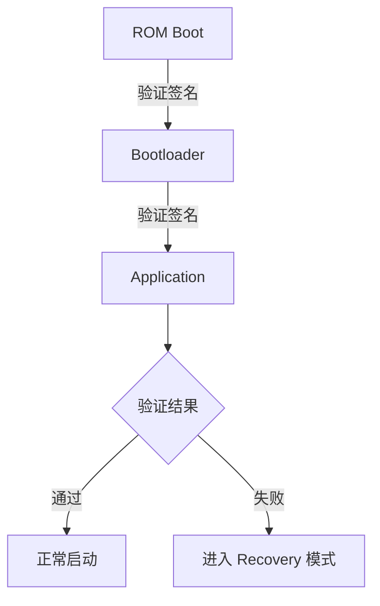

## 背景介绍

芯驰科技（SemiDrive）E3640 是一款面向汽车电子领域的高性能 MCU，广泛应用于智能座舱、ADAS 和车载网关等场景。在汽车电子系统中，安全启动（Secure Boot）是保障系统可信性的第一道防线。

安全启动的核心思想是建立一条信任链（Chain of Trust）：从芯片内部不可篡改的 ROM 代码开始，逐级验证下一级固件的完整性和真实性。只有通过验证的代码才能被执行，从而防止恶意固件注入。

## 技术流程详解

### 信任链概览

E3640 的安全启动流程遵循经典的 Root of Trust 模型。下面是整体验证流程的 Mermaid 流程图：



### 验证过程

ROM Boot 阶段是整个信任链的根。芯片上电后，CPU 从 ROM 中的固定地址开始执行。ROM 代码负责：

1. 初始化 HSM（Hardware Security Module）硬件模块
2. 读取 Bootloader 固件的数字签名
3. 使用预置的公钥验证签名的合法性
4. 验证通过后跳转到 Bootloader 入口地址

签名验证的核心算法通常采用 ECDSA（椭圆曲线数字签名算法），以下是简化的验证函数示例：

```c
/* HSM signature verification wrapper */
int hsm_verify_signature(const uint8_t *data, size_t data_len,
                         const uint8_t *sig, size_t sig_len,
                         const uint8_t *pub_key)
{
    hsm_cmd_t cmd = {
        .opcode = HSM_OP_VERIFY,
        .data   = data,
        .data_len = data_len,
        .sig    = sig,
        .sig_len = sig_len,
        .key    = pub_key
    };

    return hsm_execute(&cmd);
}
```
{: file="platform/e3640/hsm_verify.c" }

### Bootloader 到 Application

Bootloader 验证通过后，它会执行类似的流程来验证 Application 固件。这个过程中，Bootloader 还会检查固件版本号，防止回滚攻击（Rollback Protection）：

```c
static int boot_jump_to_app(uint32_t app_addr)
{
    /* Disable interrupts before jumping */
    __disable_irq();

    /* Set main stack pointer */
    __set_MSP(*(volatile uint32_t *)app_addr);

    /* Jump to application reset handler */
    void (*app_reset)(void) = (void (*)(void))(*(volatile uint32_t *)(app_addr + 4));
    app_reset();

    return 0; /* should never reach here */
}
```
{: file="platform/e3640/boot_jump.c" }

在 AUTOSAR 架构下，安全启动流程通常由 BSW（Basic Software）中的 Boot Manager 模块协调，与 Crypto Service Manager（CSM）配合完成密钥管理和签名验证。

## 总结

E3640 MCU 的安全启动流程体现了汽车电子系统对功能安全和信息安全的双重要求。通过 HSM 硬件加速和多级签名验证机制，确保了从芯片上电到应用运行的整个过程中，只有经过认证的固件才能执行。这种设计对于满足 ISO 26262 功能安全标准和 ISO/SAE 21434 汽车网络安全标准至关重要。

在实际项目中，安全启动的配置和调试需要与芯片厂商的技术支持紧密配合，尤其是在密钥管理、Fuse 烧录和 Recovery 模式设计等环节。希望本文对理解 MCU 安全启动机制有所帮助。
