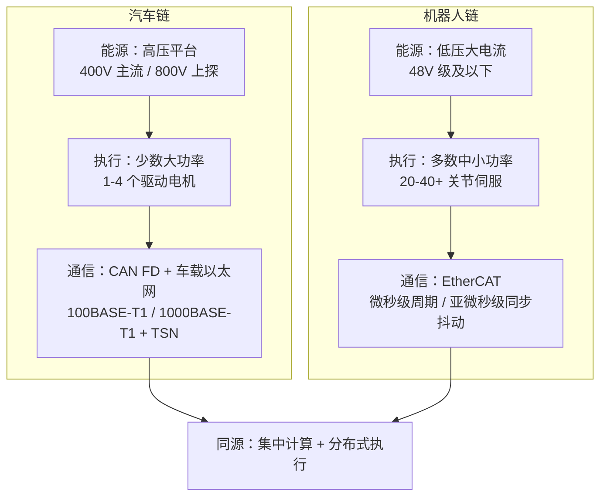
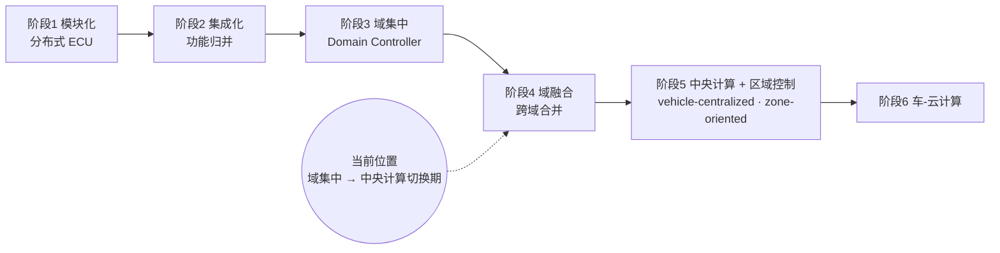
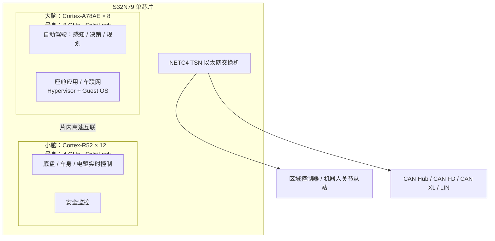

## 1 引言——为什么把汽车和机器人放在一起谈

这两年人形机器人的发布会一场接一场，翻跟头、叠衣服、进厂打工，热度像极了几年前的智能电动车。但热闹背后有一个更本质的共同点：纯电汽车和人形机器人，都是**具身智能（Embodied AI）**或者说**物理 AI** 的载体——它们都运行一个"感知 → 决策 → 执行"的闭环，而且执行端直接作用于物理世界：电机要出力、轮子或关节要动、能量要从电池里真实地流出来。这和只输出文本或图像的大模型有本质区别。

作为汽车电子工程师，我看一台人形机器人的第一反应，往往不是它演示了多炫的技能，而是下意识地拆它的**电子电气架构（EEA, Electrical/Electronic Architecture）**：电池放在哪、电压平台多少、几十个关节怎么走线、总线用的什么协议、主控和实时控制器怎么分工、安全机制怎么设计。这个职业病恰恰是本文的视角：**不从应用层谈"谁能干什么"，而是从 EEA 和软件栈两个底层维度，把汽车和机器人放在一起对照**——看它们的架构诉求哪些同源、哪些分岔，以及为什么分岔。

这个对照是有现实意义的。汽车工业用了二十多年走完的 EEA 演进路径（分布式 ECU → 域集中 → 中央计算），机器人行业正在以压缩的方式重走一遍；而机器人遇到的多轴实时控制、低压大电流能源、紧凑空间走线问题，又反过来逼迫一些汽车行业习以为常的假设被重新审视。

业界流行一种说法：汽车工业进入机器人领域是"降维打击"——供应链现成、安全体系现成、工程化能力现成，机器人不过是"会走路的汽车"。这个判断对吗？

本文想给出的答案是：**同源，但不同路**。说清楚"同源"在哪里、"不同路"在哪里，就是接下来几节的任务。先从 EEA 的三大支柱——能源、执行、通信——开始。

## 2 EEA 三大支柱：能源 / 执行 / 通信

任何一个具身智能体，无论有几个轮子还是几条腿，都必须解决三件底层的事：**能量从哪来（能源）、动作怎么产生（执行）、部件之间怎么对话（通信）**。这三根支柱上的同源与差异，构成了汽车与机器人可比性的物理基础。先用一张总表建立全景，再逐根支柱展开。

| 维度 | 纯电汽车 | 人形机器人 | 共性与差异 |
|------|---------|-----------|-----------|
| 能源 | 动力电池（锂电为主），高压平台：400V 主流、800V 在中高端上探 | 锂电池组，低压大电流（多为 48V 级及以下），关节峰值电流大 | 同源：同为电池供电，BMS / 热管理 / 充放电策略可迁移；差异：汽车高电压小电流，机器人低电压大电流 |
| 下一代能源 | 固态电池：行业目标能量密度约 500 Wh/kg（当前液态锂电约 250-300 Wh/kg，尚未量产） | 固态电池：因续航瓶颈更突出，对体积能量密度更敏感 | 共同关注固态电池，机器人体型约束下更渴求体积能量密度 |
| 执行机构 | 驱动电机 1-4 个 + 电控，单电机几十到几百 kW；少量车身电机 | 数十个关节电机 + 执行器（人形通常 20-40+ 自由度），每关节独立伺服 | 同源：同为电机驱动；差异：机器人执行器数量多一个数量级，控制粒度细得多 |
| 通信总线 | CAN / CAN-FD 仍是车身主流，骨干网转向车载以太网（100BASE-T1 / 1000BASE-T1）+ TSN | 高自由度主流 EtherCAT（微秒级周期、亚微秒级同步抖动）；中低自由度仍用 CAN / CAN-FD（如智元灵犀 X1 全身 CANFD） | 同源：都从低速总线向以太网系协议演进、都要确定性实时；差异：汽车偏 TSN 多业务融合，机器人偏 EtherCAT 多轴同步 |
| 线束拓扑 | 中央计算 + 区域控制器（Zonal），线束大幅缩减 | 主控 + 分布式关节驱动，菊花链拓扑减少走线 | 同源：都走向**集中计算 + 分布式执行** |

### 2.1 能源：电池是共同的起点，固态电池是共同的远方

从第一性原理看：**任何具身智能体都必须自带能源，而电池的能量密度上限，直接约束了这个智能体的形态和负载能力**。能量密度上不去，要么缩小体型，要么削减算力，要么接受短续航——没有第四个选项。

汽车侧的事实是：400V 平台是当前主流，800V 高压平台已在保时捷 Taycan 开创、现代起亚 E-GMP 等平台规模化之后进入中高端车型的标配区间，支撑 300 kW 级快充（10-80% 约 15 分钟量级）。高压平台的逻辑很朴素：充电功率 = 电压 × 电流，电流受线径和发热约束，想快充就只能升压。

机器人则走了另一个方向：受限于体积、安全（与人近距离接触）和现有关节电器的耐压等级，多数采用 48V 级及以下的低压平台。但几十个关节同时出力时峰值电流非常大，对电池的**放电倍率**要求反而比汽车更苛刻。这就是表中那句"汽车高电压小电流、机器人低电压大电流"的物理含义。

固态电池是双方共同的等待。需要强调一个事实口径：**约 500 Wh/kg 是行业的目标值 / 里程碑，不是已量产数字**——当前液态锂离子电池的能量密度大约在 250-300 Wh/kg。汽车看重固态电池的安全性与续航，机器人则更看重体积能量密度：它直接决定了人形机器人的体型能不能做小、负载能不能做大。能源形态的一致性，决定了二者在 BMS（电池管理系统）、热管理、充放电策略上高度可迁移——这是汽车供应链对机器人最直接的馈赠之一。

### 2.2 执行机构：从"四个轮子"到"几十个关节"

第二根支柱的公理是：**执行器的数量 × 单体功率，决定了控制系统的粒度，进而决定了控制器架构**。

汽车是"少数大功率"：驱动电机 1-4 个，单电机几十到几百 kW，控制目标是扭矩和转速，控制周期毫秒级即可满足；车身电机（车窗、雨刮、泵类）数量不少但多为低速开关量。整个执行体系的控制粒度是粗的。

机器人是"多数中小功率"：人形机器人通常 20-40+ 个自由度，每个关节一个独立伺服，要求高响应、高精度、高功率密度，还要力控闭环。控制粒度是细的，且各轴之间强耦合——一条腿的三个关节扭矩分配，直接决定机器人会不会摔倒。

这里有一个很有用的类比：**汽车的电驱总成 ≈ 机器人的关节模组；汽车的底盘控制 ≈ 机器人的全身运动控制**。今天量产上车的电驱总成（电机 + 减速器 + 逆变器 + 控制器四合一），和机器人关节模组（电机 + 谐波/行星减速器 + 驱动器 + 编码器）在工程结构上是同构的，差异只在功率等级和精度等级。汽车行业在电驱总成上的量产经验、成本控制、可靠性验证方法，可以近乎平移地用到关节模组上。

"少数大功率 vs 多数中小功率"这个分野，还会在 §2.3 的通信和 §4 的架构终局里反复出现——它是汽车与机器人架构差异的第一因。

### 2.3 通信：殊途同归的以太网，各有侧重的实时性

第三根支柱的公理是：**通信的确定性要求，随控制回路的收紧而上升——总线选型本质上是控制物理特性决定的，不是带宽决定的**。

汽车侧：CAN / CAN-FD 仍是车身电子的主流，但骨干网已经全面转向车载以太网——100BASE-T1（IEEE 802.3bw）/ 1000BASE-T1（IEEE 802.3bp）单对双绞线以太网，配合 TSN（时间敏感网络，IEEE 802.1 系列）提供确定性延迟和时间同步。汽车以太网的关键词是**多业务融合**：把诊断、座舱、智驾、控制的流量放在一张网上，用 TSN 划分优先级和保障窗口。

机器人侧：高自由度人形机器人的主流选择是 EtherCAT。这里必须把时序指标说精确：**EtherCAT 的通信周期是微秒级（数十微秒、最快可到约 12 微秒量级），而"亚微秒"指的是它通过分布式时钟（Distributed Clocks）实现的同步抖动——亚微秒级同步抖动**。周期和抖动是两个概念，混用就会得出错误的带宽/实时性结论。中低自由度的方案则仍以 CAN / CAN-FD 为主，例如智元灵犀 X1 就采用全身 CANFD。机器人总线的驱动力和汽车不同：几十个轴要做同步运动控制，任何一轴的相位漂移都会变成末端抖动，所以**多轴同步 + 极低抖动**压倒一切。

共性是明确的：两者都在抛弃传统低速总线、拥抱以太网系协议、都需要确定性实时通信。差异同样明确：汽车以太网强调 TSN 和多业务融合，机器人 EtherCAT 强调多轴同步和极低抖动。一个自然的畅想是：未来机器人会不会也走向"车载以太网 + 区域控制器"式的架构？光通信在机器人的紧凑空间内（抗干扰、减重）又有没有应用价值？这个问题在 §6 还会回来。

下面的图把三大支柱上的两条链放在一起：两条链的每一层参数都不同，但拓扑指向同一个终点。

*（概念示意图占位 · 汽车 vs 机器人三大支柱对比；作者后续 AI 生成）*

支柱是硬件，但架构的灵魂在软件。下一节把视角抬到软件栈。

## 3 软件架构：感知-决策-控制 的同构

把汽车和机器人的软件栈切成同样的五层，会得到一张几乎可以逐行对应的表：

| 软件层次 | 汽车 | 人形机器人 | 类比关系 |
|---------|------|-----------|---------|
| 感知层 | 摄像头、毫米波雷达、激光雷达、超声波 | 视觉、力觉、IMU、触觉、关节编码器 | 传感器融合与标定方法论可迁移 |
| 决策层 | 自动驾驶路径规划、行为决策 | 运动规划、任务规划、行为决策 | 规划算法框架同源（MPC、强化学习等） |
| 控制层 | 底盘控制（制动 / 转向 / 驱动）、车身控制、三电控制 | 全身运动控制、关节伺服、力控 | 实时控制理论同源 |
| 应用层 | 座舱娱乐、车联网、OTA | 人机交互、任务执行、云端协同 | 都面向用户体验与服务化 |
| 系统层 | AUTOSAR CP/AP、Hypervisor、多 Guest OS | ROS 2、RTOS、逐步引入容器化 | 都走向标准化中间件 + 虚拟化 |

系统层值得多说两句，因为它最能体现汽车行业的积累。AUTOSAR 经典平台（CP）基于 OSEK 体系的 RTOS，静态配置、信号导向（signal-based），面向 CAN / LIN 的传统通信；自适应平台（AP）则面向 POSIX/Linux 环境，以 SOME/IP 做面向服务的通信，服务 ADAS 和高性能计算场景。一句话概括：**CP 管确定性和实时，AP 管算力和服务化**——一个平台里装着两个世界。

作为汽车电子工程师，我对这张层表最深的第一人称观察是：**这个"A 核 / R 核两个世界"的分裂，就是我日常工作的形状**。做车身或底盘的 AUTOSAR CP 工程时，打交道的是静态配置的 BSW、毫秒级任务、信号矩阵；一旦场景切到 ADAS 数据流，就进入 AP / POSIX、大内存、服务发现的世界。两套世界观的切换成本，逼出了 Hypervisor、多 Guest OS 这些"软隔离"技术。而机器人行业今天正在重演这一幕：ROS 2 的话题 / 服务机制天然是"AP 世界"的产物，但几十个关节的伺服控制又是标准的"CP 世界"问题——这就是为什么当前机器人普遍采用"x86 主控 + 嵌入式实时控制器"的双脑架构（§4.4 再展开）。

比分层同构更有分量的，是**工程体系的可迁移性**：

- **功能安全**：ISO 26262 的 ASIL A-D 分级方法论、HARA 分析、安全机制设计，机器人直接可用；
- **预期功能安全**：SOTIF（ISO 21448:2022）处理"系统没坏但能力不足"的场景，对机器人的非结构化环境尤其相关；
- **信息安全**：ISO/SAE 21434:2021 的全生命周期网络安全工程，机器人一旦联网就同样面对；
- **流程成熟度**：ASPICE 六个能力等级（0-5），主机厂普遍要求供应商达到 2 / 3 级——这套研发过程纪律是机器人创业公司最缺、也最难速成的；
- **工程化能力**：OTA、诊断（UDS）、日志与失效分析，汽车行业都已趟过路。

软件栈的同构是"同源"最有力的证据。那么演进的方向呢？两条赛道会不会收敛到同一个架构终局？这是 §4 的问题。

## 4 架构演进终局：中央计算 + 区域控制

### 4.1 汽车 EEA 的演进路径：博世六阶段模型

博世把汽车 EEA 的演进分成六个阶段，这是行业引用最广的路线图：

1. **模块化**：分布式 ECU，一个功能一个盒子；
2. **集成化**：功能向少量 ECU 归并；
3. **域集中**：按功能域整合出域控制器（智驾域、座舱域、底盘域）；
4. **域融合**：跨域合并，域控制器数量继续减少；
5. **中央计算 + 区域控制**：整车中央计算平台 + 按物理位置划分的区域控制器——注意博世对第 5 阶段的表述是 vehicle-centralized、**zone-oriented**，"区域化"明确属于第 5 阶段；
6. **车-云计算**：部分算力与决策上移到云端。

当前行业的位置，普遍认为正处于**"域集中 / 域融合 → 中央计算 + 区域控制"的切换期**——下一代平台的设计几乎都按中央计算 + Zonal 规划。

*（概念示意图占位 · 汽车 EEA 演进六阶段（博世模型）；作者后续 AI 生成）*

被引用最多的落地案例是特斯拉 Cybertruck：据拆解报道，它采用数个区域车身控制器（前 / 后 / 左 / 右布局）加中央计算单元（FSD 计算机与信息娱乐主机）的架构，区域控制器就近接入本区负载，再通过骨干网上收中央计算；线束长度较传统方案缩减约 77%（Tesla 披露 / 行业报道口径，非独立实测）——这个缩减由**区域化整合 + 48V 低压架构 + Etherloop 车载以太网**共同促成。需要提醒：具体的区域控制器和计算单元数量官方并未精确公开，引用时应按拆解报道口径标注"约"。

### 4.2 中央控制器的"大脑 + 小脑"构想

中央计算 + 区域控制之后，再往前一步是什么？我们不妨这样类比：把未来的中央控制器看成一个"**大脑 + 小脑**"系统——

- **大脑**：跑在 Cortex-A 类高性能核上，负责感知、决策、规划、人机交互——高复杂度、非强实时、吃算力；
- **小脑**：跑在 Cortex-R 类实时核上，负责运动控制、实时响应、安全监控——低延迟、强实时、确定性。

需要明确：**"大脑 / 小脑"是本文的类比，并非行业标准术语**——不过这个方向并非我一家之言，芯片厂商也有类似的表达，NXP 自己就把 S32N 系列称作 "the brain of SDVs"。趋势判断是：大脑和小脑不再是物理分离的两个控制器，而是**同一颗多核异构芯片上的两个核群**，通过片内高速总线互联。

### 4.3 芯片标杆：NXP S32N79 的启示

这个"单芯片大脑 + 小脑"构想已经有可对标的实物。NXP 的 S32N79 是目前公开资料里最完整的样本，它的核心配置（以下均为官方公开规格）：

- **8 个支持 Split/Lockstep 的 Arm Cortex-A78AE**（最高 1.8 GHz）——"大脑"核群；
- **12 个支持 Split/Lockstep 的 Arm Cortex-R52**（最高 1.4 GHz）——"小脑"核群；
- RISC-V 内核的网络与数学加速器；
- eIQ Neutron NPU（厂商未公开 TOPS 数据；第三方报道称约 2 TOPS，仅供参考）；
- CAR-V **versatile** 加速器——versatile 是 NXP 的官方措辞，指它面向网络 / 报文处理的多用途加速模块；
- 安全能力：最高 ASIL D，XRDC 硬件资源隔离，HSE2 硬件安全引擎；
- 通信：NETC4 TSN 以太网交换机、CAN Hub / CAN FD / CAN XL / LIN，以及 PCIe Gen 4。

软件部署的构想是：**R52 核群跑 Hypervisor + Guest OS，划分底盘控制、车身控制、电驱控制、安全监控等强实时域；A78AE 核群同样虚拟化，承载自动驾驶、座舱应用、车联网服务等大算力域**。一颗芯片同时收编大脑和小脑，用 XRDC 做域隔离，用 NETC4 做对外的确定性通信——这基本就是 §4.2 构想的工程化落地。

下面的部署示意图把这套构想画出来（再次强调：大脑 / 小脑划分为本文类比）：

*（概念示意图占位 · S32N79 大脑 + 小脑部署（本文类比）；作者后续 AI 生成）*

S32N79 不会是孤例。可以预判各家芯片厂商（NXP、TI、英飞凌、瑞萨、地平线等）都会推出类似的"超级集成"芯片，竞争点在三处：**核群配比**（A/R/NPU 怎么搭）、**安全隔离能力**（XRDC 这类硬件隔离 + ASIL D 认证路线）、**软件生态**（Hypervisor、AUTOSAR、中间件的成熟度）。

### 4.4 对机器人的启示

回到机器人。当前主流的人形机器人架构是"x86 主控（大脑）+ 嵌入式实时控制器（小脑）"的物理分离方案——正好对应 §3 结尾说的两个世界。汽车路线给出的启示是：**是否可以借鉴"多核异构单芯片 + 分布式关节从站"，把双脑合体？**

冷静地看，机器人的"小脑"要求可能比汽车更苛刻：

- **轴数**：几十个关节的同步控制，对实时核数量和通信调度的要求超过汽车底盘；
- **响应**：力控闭环要微秒级响应，摔倒保护更是毫秒必争；
- **力控**：汽车的执行机构基本不与环境发生持续的力交互，机器人全身都是接触界面。

而机器人的"大脑"要求同样不低：视觉感知、大模型推理、语义理解，NPU 算力需求持续攀升。单芯片方案的诱惑在于减重、减线束、降功耗——这些恰恰是机器人最痛的约束。汽车已经用 S32N79 这类芯片证明了路线可行性，剩下的问题是核群配比和软件生态能否跟上机器人更紧的实时约束。

## 5 "降维打击"辨析：同源不同路

现在可以回答 §1 的问题了：**"汽车对机器人是降维打击"这个流行说法，对了一半。**

### 5.1 汽车确实有可迁移的优势

- **供应链成熟**：车规级芯片、传感器、电机、连接器的产业链完整且成本已被千万级年销量摊薄；
- **安全体系完善**：ISO 26262 功能安全、ISO/SAE 21434 信息安全、SOTIF、ASPICE——整套研发与认证体系现成；
- **工程化能力**：大规模量产、OTA、诊断、可靠性验证的方法论和工具链现成；
- **软件生态**：AUTOSAR、Hypervisor、SOA 架构的实践积累现成。

这四个"现成"是真的。机器人公司确实在大量招聘汽车电子工程师、采购车规供应链、复用汽车的安全方法论——本文描述的同源性，正是这种复用的底层依据。

### 5.2 但机器人有汽车经验覆盖不到的独特挑战

- **三维物理交互**：汽车在二维平面运动，与环境的接触基本只有轮胎与路面；机器人在三维空间里与环境 / 人直接接触，碰撞安全和力控要求完全是另一个量级；
- **自由度数量级差异**：4 个轮子 vs 20-40+ 个关节，全身协调控制的计算复杂度非线性增长；
- **平衡与步态**：双足动态平衡是汽车不存在的问题——汽车没有"摔倒"这个概念；
- **精细操作**：灵巧手的抓取与操作精度，远超汽车执行机构的需求；
- **能源约束更紧**：体积小、电池容量有限，但执行器多、峰值功率大，续航是硬约束；
- **非结构化环境**：汽车行驶在相对结构化的道路 + 交通规则体系里，机器人要应对的是毫无规则的家庭 / 工厂场景。

这六条里任何一条，都不是汽车经验的简单搬运能解决的。物理交互、平衡、非结构化环境这三条，甚至没有成熟的标准体系可循。

### 5.3 结论：同源不同路

所以结论是：不是降维打击，而是**同源不同路**。汽车的架构方法论、工程体系、供应链可以为机器人所用——"汽车趟过路，机器人要走更难的路"。趟过路的意义是路标和补给，不是终点：机器人在实时性、多轴协同、力控、人机安全上，必须走一段汽车没有走过的、更难的路。

## 6 商业化节奏与远期展望

架构之外补一张商业化对照表，帮助校准两条赛道的时间尺度：

| 维度 | 汽车 | 人形机器人 |
|------|------|-----------|
| 智能化落地 | L2+ 大规模量产，L3 逐步落地，已产生真实商业价值 | 发展期：工业场景先行，家庭场景尚未规模落地 |
| 安全规范 | ISO 26262 / ISO/SAE 21434 / SOTIF（ISO 21448:2022）体系成熟 | ISO 13482 现版标准范围已更新为服务机器人的安全要求（safety requirements for service robots），覆盖个人与专业 / 商用服务机器人；工业机器人归 ISO 10218、协作场景叠加 ISO/TS 15066；整体体系仍在完善 |
| 量产规模 | 千万级年销量，供应链成本充分摊薄 | 万台级起步（2025-2026 逐步上量），成本仍高 |
| 商业模式 | 整车销售 + 软件订阅 + 服务 | 整机销售 + 租赁 + 场景化解决方案 |

机器人可以借鉴汽车的体系化安全思路，但要针对人机物理交互增加新维度——碰撞力限制、急停响应、协作安全，这些在 ISO/TS 15066（协作机器人）里已有雏形，人形机器人还需要进一步扩展。市场空间上，机器人替代人力的场景数量可能远多于自动驾驶，天花板或许更高，但那是更远期的事。

再往后看（以下均为**畅想**，非近期工程判断），有几个方向可能改写本文的全部前提：

- **固态电池普及**：若约 500 Wh/kg 的行业目标实现量产，机器人续航和体型约束大幅缓解，汽车充电时间进一步缩短——这是四条里最"硬"的一条，因为它有明确的量化目标；
- **光通信上车 / 上机**：汽车的"光盒"方案若成熟，机器人内部也可能用光纤替代铜线，提升带宽、减重、增强抗干扰——对走线空间近乎零余量的人形机器人尤其有吸引力；
- **类脑 / 神经形态计算**：事件驱动、低功耗的特性，可能比帧驱动的主流视觉更适合机器人的实时感知与运动控制；
- **脑机接口**：从"人操作机器"到"人脑直连机器"，会重写人机交互的底层逻辑——无论对汽车还是机器人都是长周期变量。

## 7 结语——两次探索，一个范式

把全文收拢成三句话：

1. **同源**：在能源、执行、通信三大支柱和感知-决策-控制的软件栈上，汽车与机器人面对的是同一组物理约束，架构解法高度可参照——EEA 的演进路线（分布式 → 域集中 → 中央计算 + 区域控制）对机器人有直接的路线图价值；
2. **不同路**：三维物理交互、数十自由度协调、双足平衡、力控、非结构化环境——这些机器人独有的难题，决定了它不能照抄汽车答案；
3. **终局猜想**：汽车和机器人是具身智能在不同形态下的两次探索，它们会持续互相借鉴、互相启发，最终共同推动"物理 AI"这一底层技术范式的成熟——也许某一天，真的会出现一个同时支撑汽车和机器人的"物理 AI 操作系统"。

对从业者而言，更实际的说法是：如果你在做汽车电子，你手里的 EEA、AUTOSAR、功能安全经验，正在成为机器人行业最抢手的通货；如果你在做机器人，汽车行业二十年的架构演进史，是你能找到的最完整的免费教科书。

**相关阅读**：安全启动与可信根的芯片级落地，见 [《MCU 安全启动流程分析》](/posts/secure-boot-analysis/) 与 [《芯驰 E3640 安全启动剖析》](/posts/semidrive-e3640-secure-boot/)。
